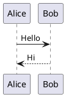

# Math Notes Previewer

A static, browser-based Markdown notes app with live-preview editing for math-heavy notes.

It supports Markdown, LaTeX math, syntax-highlighted code blocks, PlantUML diagrams, Markdown file import, PWA install, and optional PWA file handling for `.md` files.

## Features

- Obsidian-style block live preview
- Markdown rendering with GitHub-flavored Markdown
- Inline and display LaTeX via MathJax
- Syntax-highlighted fenced code blocks
- PlantUML diagram rendering from ` ```plantuml ` fences
- Import `.md`, `.markdown`, and text files
- PWA manifest and app icons
- Offline-capable service worker for deployed builds

## Usage

Open `index.html` through a local static server or deploy it to GitHub Pages.

For local development:

```powershell
python -m http.server 5173
```

Then open:

```text
http://localhost:5173/
```

## Markdown Examples

Inline math:

```markdown
Inline math: $a^2 + b^2 = c^2$
```

Display math:

```markdown
$$
\int_0^1 x^2 \, dx = \frac{1}{3}
$$
```

Code block:

````markdown
```python
def square(x):
    return x * x
```
````

PlantUML:

````markdown

````

## GitHub Pages

This project is fully static, so it can be hosted directly on GitHub Pages.

1. Push the repository to GitHub.
2. Go to repository Settings.
3. Open Pages.
4. Choose the branch and folder that contain `index.html`.
5. Save and open the generated Pages URL.

## Opening Markdown Files

The app includes a normal `Import MD` button that works in all modern browsers.

It also includes PWA file handling in `manifest.webmanifest`. After installing the app as a PWA in a supported browser, the operating system may allow `.md` files to open with the installed app.

Browsers cannot let a website read arbitrary local files from a terminal command like `app filename.md` unless the app is installed and the browser/OS supports PWA file handling. This is a web security limitation.

## Notes

- PlantUML rendering uses the public PlantUML server, so diagrams require internet access.
- On `localhost`, the app unregisters the service worker to avoid stale development caches.
- On deployed static hosting, the service worker caches the local app files for offline use.

